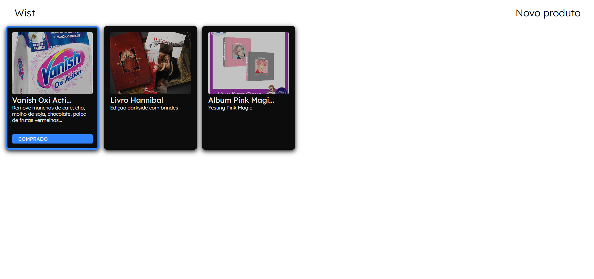
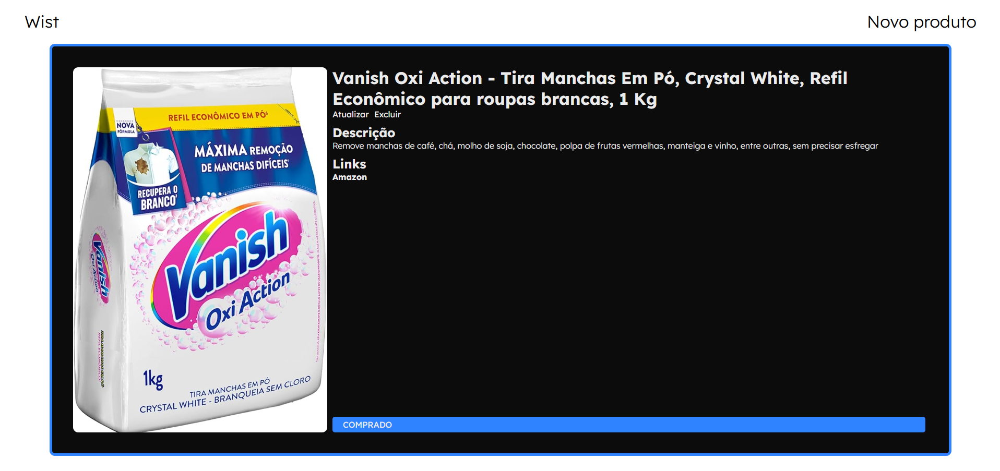
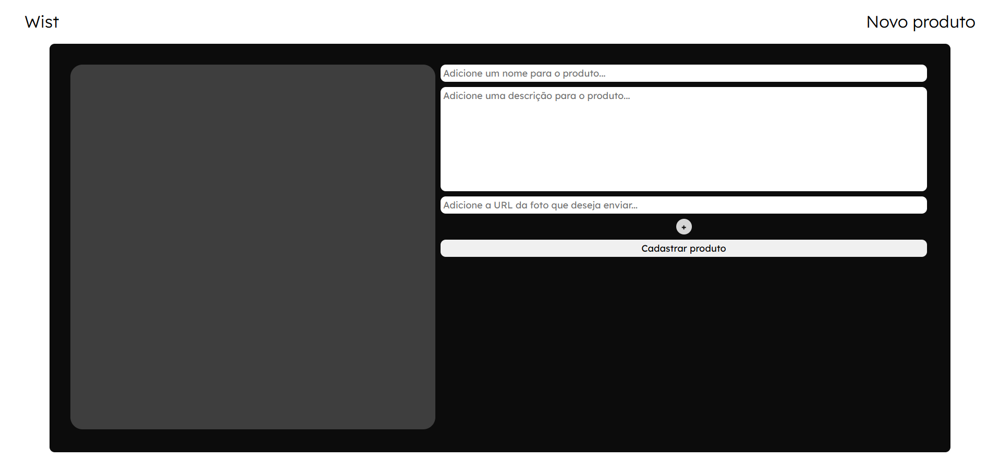
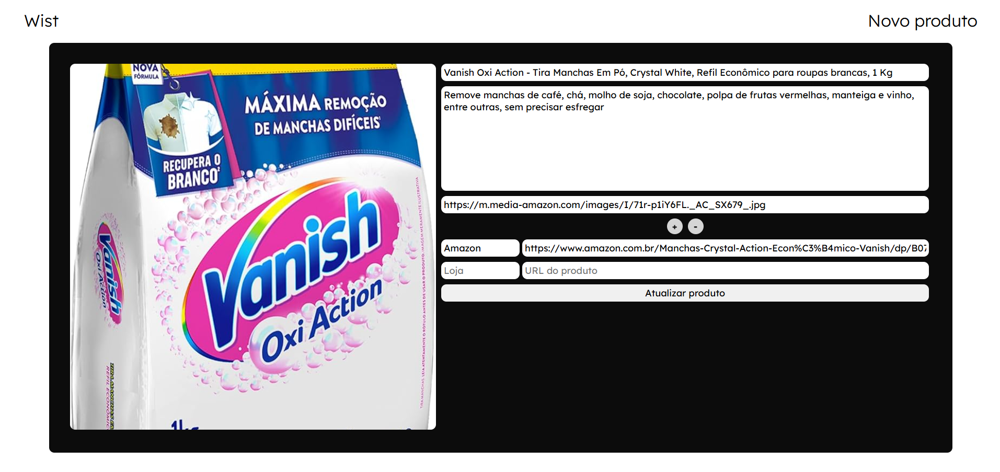
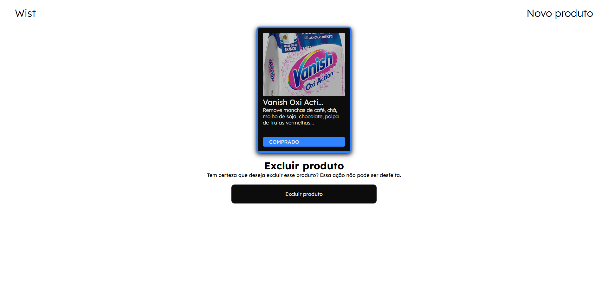

# Wist - Your brand new wishlist

**Wist** is a simple project made for the user to save his desired products into one list,
using the websources where he could buy it. *Simple as that!*

Describe it, update it, mark it as bought, delete it. Manage your products as you want.

Want to test the application? Use [Running the code](#running-the-code).
## Visual

## Running the code

[TBD]